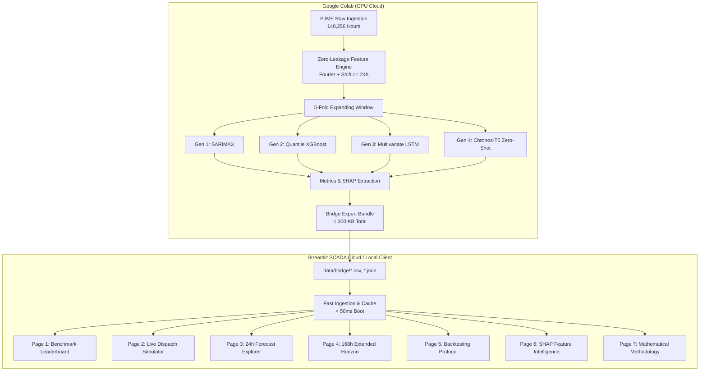

# ⚡ Grid Intelligence: Probabilistic Energy Demand Forecasting

[](https://www.python.org/)
[](https://pytorch.org/)
[](https://xgboost.ai/)
[](https://github.com/amazon-science/chronos-forecasting)
[](https://energy-grid-intelligence.streamlit.app/)
[](https://opensource.org/licenses/MIT)

> **An empirical benchmark across four generations of time-series architecture** (Classical Statistical $\rightarrow$ Tree Ensemble $\rightarrow$ Deep Recurrent $\rightarrow$ Pretrained Foundation Model) on the **PJM Interconnection (Eastern US Grid)** with rolling-origin expanding window backtesting, calibrated quantile envelopes ($q_{10}, q_{50}, q_{90}$), and an interactive grid dispatch stress-test simulator.

---

## 🌐 Live Application & Resources

* **🚀 Live Interactive SCADA Console**: **[energy-grid-intelligence.streamlit.app](https://energy-grid-intelligence.streamlit.app/)**
* **⚡ Master Colab Training Pipeline**: [`notebooks/master_training_pipeline.ipynb`](notebooks/master_training_pipeline.ipynb)
* **📊 Dataset Provenance**: [PJM Hourly Energy Consumption (Kaggle / Rob Mulla)](https://www.kaggle.com/datasets/robikscube/hourly-energy-consumption) — 140,256 continuous hourly observations (2002–2018).

---

## 🏆 Benchmark Leaderboard

Evaluated via an **Expanding Window Protocol (5 Folds)** on out-of-sample grid demand (~32,000 MW mean demand).

### 🟢 Primary 24-Hour Horizon (Day-Ahead Market Dispatch)
| Rank | Model | Generation | MAE (MW) ↓ | RMSE (MW) ↓ | MAPE (%) ↓ | 80% Coverage | Winkler Score ↓ |
| :---: | :--- | :--- | :---: | :---: | :---: | :---: | :---: |
| 🥇 | **LSTM** | Gen 3 Deep Learning | **1,939.0** | 2,954.1 | **4.95%** | **87.5%** | 10,906.8 |
| 🥈 | **Chronos-T5** | Gen 4 Foundation Model (Zero-Shot) | 2,037.2 | 3,351.5 | **5.24%** | **76.7%** | 11,869.6 |
| 🥉 | **XGBoost** | Gen 2 Gradient Boosted Trees | 2,076.8 | **2,658.2** | **5.42%** | **85.8%** | **9,238.2** |
| 4 | **SARIMAX** | Gen 1 Classical Statistical Baseline | 5,120.6 | 5,505.7 | 13.71% | 22.5% | 15,240.1 |

*Nominal coverage is 80.0% ($q_{10}$ to $q_{90}$). Winkler Score evaluates interval sharpness and penalizes boundary breaches (lower is better).*

### 🟡 Extended 168-Hour Horizon (7-Day Operating Week Ahead)
| Rank | Model | Generation | MAE (MW) ↓ | RMSE (MW) ↓ | MAPE (%) ↓ | 80% Coverage |
| :---: | :--- | :--- | :---: | :---: | :---: | :---: |
| 🥇 | **XGBoost** | Gen 2 Gradient Boosted Trees | **2,661.0** | **3,461.3** | **7.14%** | **72.6%** |
| 🥈 | **LSTM** | Gen 3 Deep Learning | 3,639.4 | 4,665.5 | 10.05% | 52.9% |
| 🥉 | **Chronos-T5** | Gen 4 Foundation Model (Zero-Shot) | 4,662.8 | 6,026.4 | 12.97% | 44.5% |
| 4 | **SARIMAX** | Gen 1 Classical Statistical Baseline | 7,064.2 | 8,775.7 | 19.20% | 33.1% |

---

## 🔬 Key Architectural & Portfolio Insights

1. **Zero-Shot Foundation Competitive at Short Horizons**:  
   Amazon Chronos-T5 achieved **5.24% MAPE** with **zero feature engineering** and **zero parameter tuning**, taking raw univariate history as tokenized context.
2. **Feature Engineering Prevents Long-Horizon Drift**:  
   Chronos-T5-small is pretrained on context lengths up to 64 tokens. On the extended 168-hour (7-day) horizon, its performance degrades to 12.97% MAPE. In contrast, **XGBoost dominated the 168h benchmark (7.14% MAPE)** because our engineered `lag_168h` and `lag_336h` autoregressive features explicitly preserve weekly grid periodicity.
3. **Calibrated Uncertainty via Proper Scoring**:  
   Rather than simple point forecasts, models output empirical quantiles ($q_{10}, q_{50}, q_{90}$). XGBoost achieved the best **Winkler Score (9,238.2)**, reflecting tight intervals with high empirical coverage (85.8%).

---

## 🏗️ System Architecture & Bridge Pipeline



---

## 🔒 Methodological Rigor: Zero Temporal Leakage

Time series models frequently leak future information through misaligned lag shifts or rolling calculations. This project enforces strict causal isolation:
1. **Minimum Lag $\ge$ Horizon**: Any autoregressive feature uses $\text{shift}(k)$ where $k \ge 24$ hours for day-ahead forecasting.
2. **Pre-Shifted Rolling Windows**: Rolling means, standard deviations, and extrema are calculated on shifted series:
   ```python
   df['rolling_mean_24h'] = df['PJME_MW'].shift(24).rolling(24).mean()
   ```
3. **Continuous Fourier Encodings**: Avoids artificial step discontinuities at Hour 23 $\rightarrow$ Hour 0:
   $$\text{hour\_sin} = \sin\left(\frac{2\pi \cdot \text{hour}}{24}\right), \quad \text{hour\_cos} = \cos\left(\frac{2\pi \cdot \text{hour}}{24}\right)$$
4. **Expanding Window Backtesting**: 5 contiguous evaluation windows over the final 840 hours of data, with training history expanding chronologically.

---

## 🧠 Feature Importance (SHAP vs Split Gain)

Top drivers discovered by `shap.TreeExplainer` on the 35-feature matrix:
* **`lag_24h`**: 3,756.3 MW mean $|SHAP|$ (Dominant day-ahead autoregressive baseline)
* **`lag_168h`**: 642.2 MW mean $|SHAP|$ (Dominant 7-day weekly periodicity)
* **`biz_x_lag24`**: 430.4 MW mean $|SHAP|$ (Business hour $\times$ previous day interaction)
* **`dayofweek`**: 376.1 MW mean $|SHAP|$ (Weekday vs weekend structural shift)
* **`lag_336h`**: 335.4 MW mean $|SHAP|$ (Fortnightly autoregressive anchor)

---

## 💻 Local Quickstart (30 Seconds)

Clone the repository and launch the dashboard locally without needing any API keys or GPU:

```bash
# 1. Clone repository
git clone https://github.com/mshaiel/energy-demand-forecasting.git
cd energy-demand-forecasting

# 2. Install lightweight requirements
pip install -r requirements.txt

# 3. Launch Streamlit SCADA Dashboard
streamlit run dashboard/app.py
```
Open **`http://localhost:8501`** in your browser.

### Run Automated Unit Tests
```bash
pytest -v
```
*(All 13 unit tests verifying feature transforms, zero leakage, proper scoring rules, and schema validation pass in under 1 second).*

---

## 📂 Repository File Hierarchy

```
energy-demand-forecasting/
├── README.md                          ← Project showcase & benchmark presentation
├── LICENSE                            ← MIT Open Source License
├── .gitignore                         ← Excludes raw datasets & virtualenvs
├── requirements.txt                   ← Streamlit Cloud dependencies
├── requirements_local.txt             ← Lightweight local dependencies
├── requirements_colab.txt             ← Full GPU dependencies for Colab training
│
├── dashboard/
│   ├── app.py                         ← Streamlit SCADA entrypoint & pre-warmer
│   ├── utils.py                       ← Cached data loaders & telemetry components
│   ├── assets/
│   │   └── style.css                  ← Institutional SCADA dark styling
│   └── pages/
│       ├── 01_overview.py             ← Executive benchmark leaderboard & radar chart
│       ├── 02_dispatch_simulator.py   ← ⚡ Live Grid Stress-Tester & Peak Dispatch Simulator
│       ├── 03_24h_forecast.py         ← Interactive 24h fold forecast explorer
│       ├── 04_168h_forecast.py        ← 7-Day extended trajectory & uncertainty spread
│       ├── 05_backtesting.py          ← Gantt timeline, stability & calibration charts
│       ├── 06_feature_importance.py   ← SHAP TreeExplainer ranking & Fourier polar plot
│       └── 07_methodology.py          ← Formal math, proper scoring & research citations
│
├── notebooks/
│   ├── README.md                      ← Colab execution instructions
│   ├── master_training_pipeline.ipynb ← ⚡ Unified Colab notebook (T4 GPU runner)
│   ├── 01_eda_and_cleaning.ipynb      ← Exploratory analysis & ADF stationarity
│   ├── 02_feature_engineering.ipynb   ← Temporal & cyclical feature construction
│   ├── 03_backtesting_framework.ipynb ← 5-Fold expanding-window generator
│   ├── 04_gen1_sarimax.ipynb          ← Classical baseline
│   ├── 05_gen2_xgboost.ipynb          ← Quantile gradient boosting
│   ├── 06_gen3_lstm.ipynb             ← Multivariate LSTM with MC Dropout
│   ├── 07_gen4_chronos.ipynb          ← Amazon Chronos-T5 zero-shot inference
│   └── 08_results_export.ipynb        ← Bridge assembly & schema validation
│
├── src/
│   ├── data/
│   │   ├── loader.py                  ← Data ingestion & bridge loaders
│   │   └── validator.py               ← Bridge schema & quantile monotonicity validation
│   ├── features/
│   │   └── temporal.py                ← Zero-leakage temporal, cyclical & lag transforms
│   ├── evaluation/
│   │   └── metrics.py                 ← MAE, RMSE, MAPE, Winkler Score, Pinball Loss
│   └── visualization/
│       └── plots.py                   ← Plotly SCADA dark-mode figure factories
│
├── data/
│   ├── raw/                           ← Raw PJME_hourly.csv (.gitignored)
│   └── bridge/                        ← ✅ Committed lightweight deliverables (< 300 KB)
│       ├── forecast_results.csv       ← 5-Fold predictions for all 4 models
│       ├── metrics_summary.json       ← Pre-computed aggregate proper scoring metrics
│       ├── feature_importance.json    ← XGBoost gain & SHAP values
│       └── fold_metadata.json         ← Backtesting temporal boundaries
│
├── configs/
│   ├── model_config.yaml              ← Model hyperparameters across all 4 generations
│   └── backtest_config.yaml           ← 5-Fold dates & horizon specifications
│
└── tests/
    ├── test_features.py               ← Tests for cyclical math & lag leak prevention
    ├── test_metrics.py                ← Tests for Winkler score & coverage calibration
    ├── test_plots.py                  ← Tests for all Plotly figure factories
    └── test_validator.py              ← Tests for schema & crossing quantile detection
```

---

## 📜 Citation & References

* **Amazon Chronos**: Ansari et al., *"Chronos: Learning the Language of Time Series"*, arXiv:2403.07815 (2024).
* **XGBoost Quantile Regression**: Chen & Guestrin, *"XGBoost: A Scalable Tree Boosting System"*, ACM SIGKDD (2016).
* **Monte Carlo Dropout Uncertainty**: Gal & Ghahramani, *"Dropout as a Bayesian Approximation: Representing Model Uncertainty in Deep Learning"*, ICML (2016).
* **Winkler Scoring Rule**: Winkler, R. L., *"A Decision-Theoretic Approach to Interval Estimation"*, JASA (1972).
